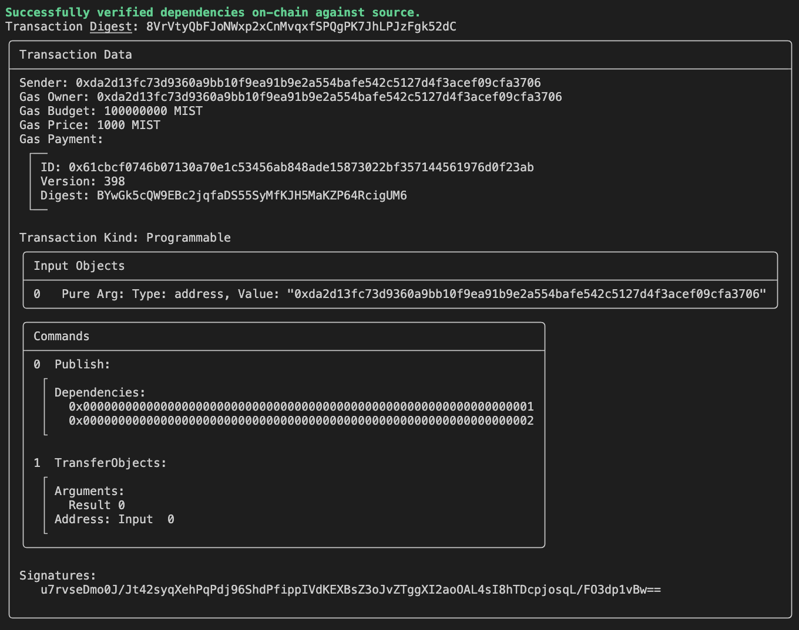
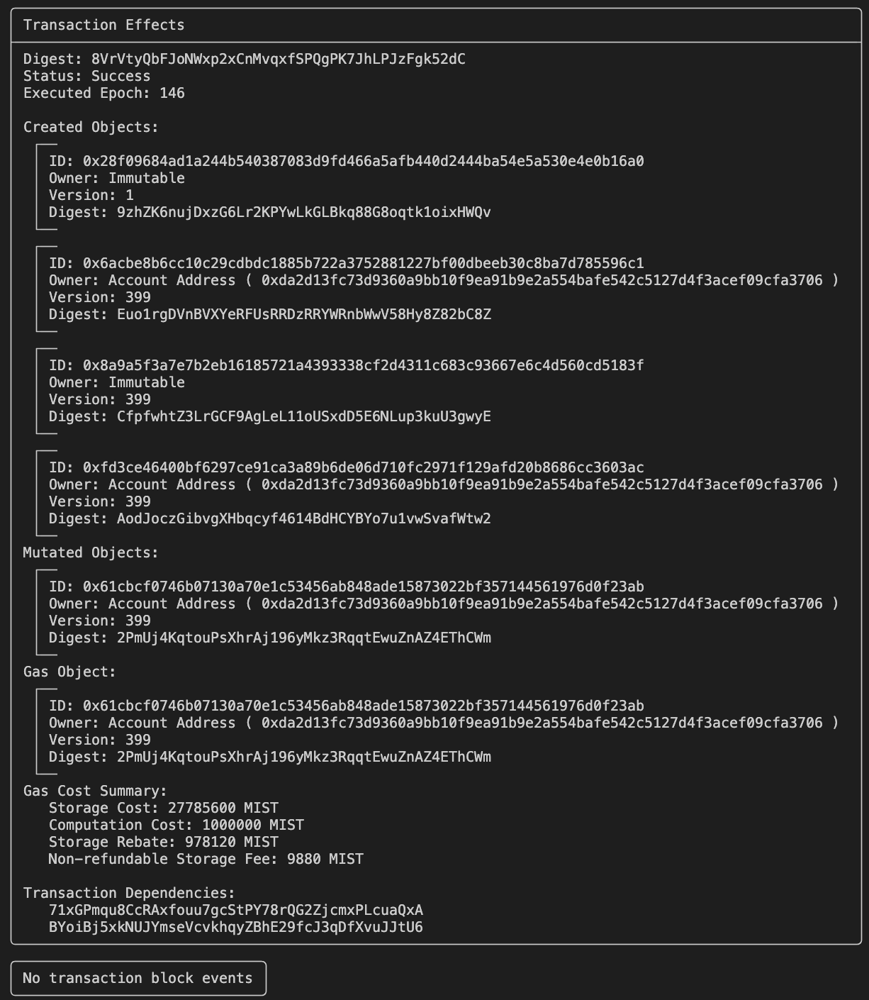
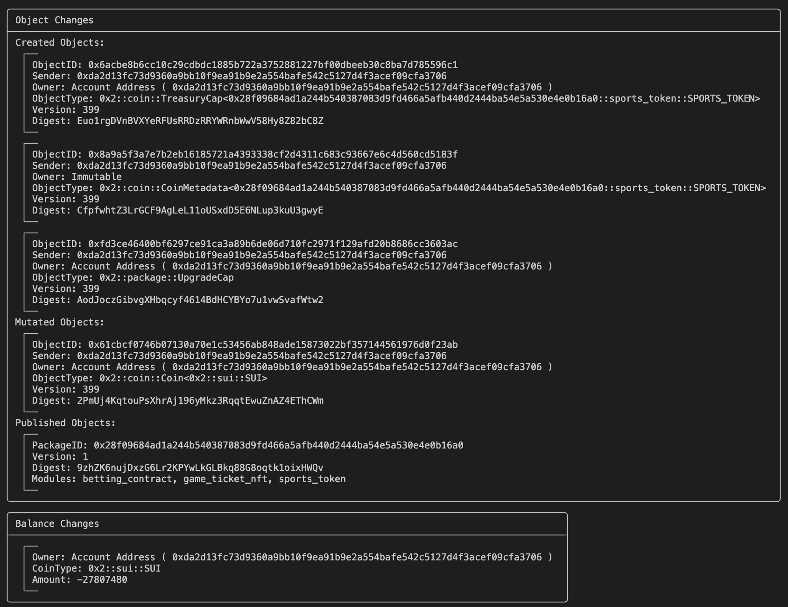
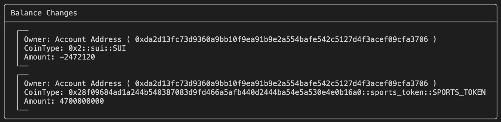
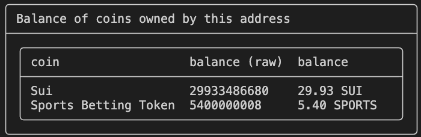
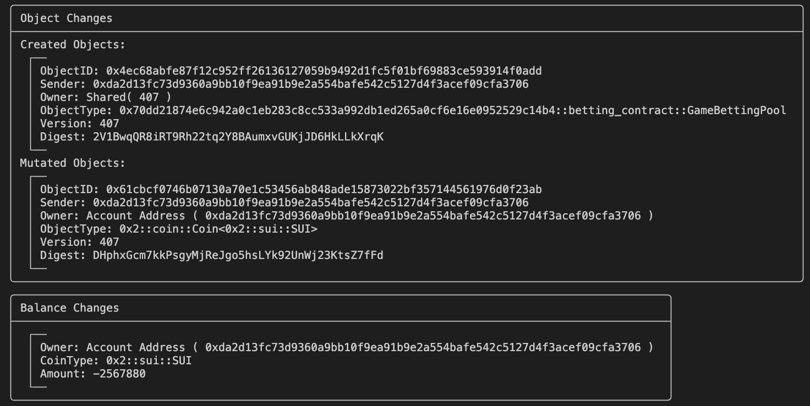
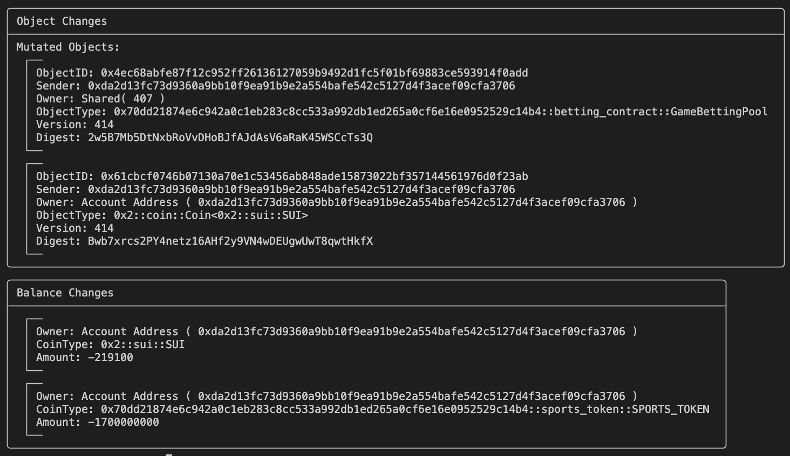
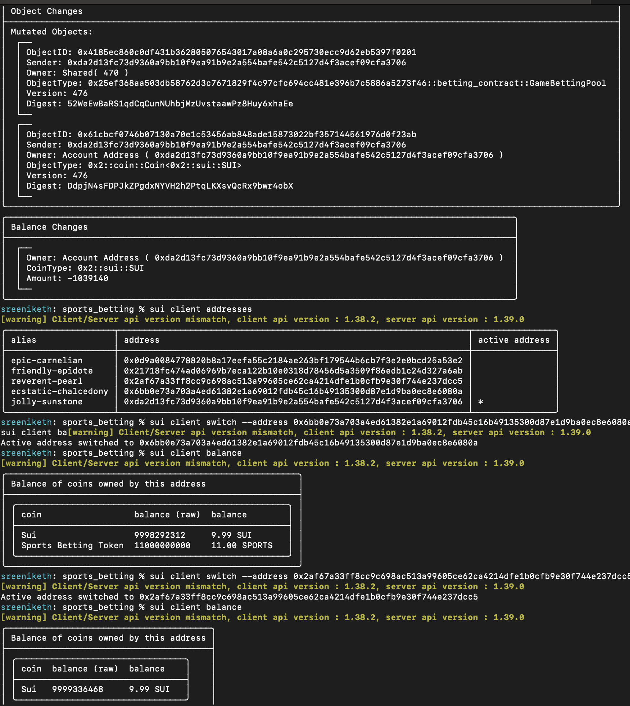

# Sports Betting Platform on Sui Blockchain

## Project Overview

This decentralized application (dApp) provides a comprehensive sports betting and ticketing platform built on the Sui blockchain. The project combines multiple key features:

- Custom Sports Token (SPORTS)
- NFT-based Game Tickets
- Decentralized Betting Mechanism
- Telegram Mini App Integration

## Smart Contracts

### 1. Sports Token (`sports_betting::sports_token`)
- Custom fungible token for platform transactions
- Token Symbol: SPORTS
- 9 decimal places
- Supports minting and burning tokens

#### Key Functions:
- `mint()`: Create new tokens
- `burn()`: Destroy existing tokens

### 2. Game Ticket NFT (`sports_betting::game_ticket_nft`)
- Represents unique event tickets
- Supports ticket minting, transfer, and burning

#### Key Functions:
- `mint_ticket()`: Create a new game ticket NFT
- `transfer_ticket()`: Send ticket to another address
- `burn_ticket()`: Destroy ticket if needed

### 3. Betting Contract (`sports_betting::betting_contract`)
- Manages game betting pools
- Handles bet placement and resolution
- Supports different bet types (Team A, Team B, Draw)

#### Key Functions:
- `create_betting_pool()`: Initialize a new betting pool for a game
- `place_bet()`: Allow users to place bets
- `resolve_bets()`: Distribute winnings after game conclusion

## Deployment

### Prerequisites
- Sui CLI installed
- Sui devnet access
- Wallet with sufficient SUI for gas fees

### Deployment Steps
1. Compile the Move modules
```bash
sui move build
```

2. Deploy to Sui Devnet
```bash
sui client publish --path . --gas-budget 100000000
```

## Telegram Mini App Integration

The platform includes a Telegram mini app that allows users to:
- View available games
- Place bets using SPORTS tokens
- Check betting pool status
- Manage tickets

## Technical Stack
- Blockchain: Sui
- Smart Contract Language: Move
- Frontend: React (for web application)
- Mobile Integration: Telegram Mini App

## Features

### Token Economics
- Custom SPORTS token for platform transactions
- Flexible minting and burning mechanism

### Ticketing System
- NFT-based tickets with detailed game information
- Transferable and burnable tickets
- Unique identifier for each game ticket

### Betting Mechanism
- Decentralized betting pools
- Multiple bet types supported
- Transparent payout calculation
- Secure bet resolution

## Security Considerations
- Smart contracts audited and tested on Sui devnet
- Secure token and betting pool management
- Transparent bet resolution mechanism

## Future Roadmap
- Add more advanced betting options
- Implement dynamic odds calculation
- Expand sport game coverage
- Enhance Telegram mini app features

## License
Distributed under the MIT License. See `LICENSE` for more information.

## Contact
- Project Link: [Your Project Repository URL]
- Developer: [Your Name/Contact]

## Acknowledgments
- Sui Blockchain
- Move Programming Language
- Telegram Platform

## Deployed contracts on devnet





Deployed Package Id: `0x99b13bbf32aff83c8a640abb2d071acafd3811cf2e3045a1645828b0ba4a2a4b`

Treasury Cap Id: `0x471584572ef926c40ea665d0f34685c2af408ab42f28380a976948ff99ec5b9e`

### Using CLI to interact with contracts

### Mint Tokens:
Run:
    
    sui client call --package <package-id> \
    --module sports_token \
    --function mint \
    --args <treasury-cap-id> <raw-balance> <recipient-id>

`1000000000 balance` would mean `1 Sports Betting Token`

Output:



### Get Balance: 
Run:

    sui client balance

Output:


### Create Betting Pool
Run:

    sui client call --package <package-id> \
    --module betting_contract \
    --function create_betting_pool \
    --args <pool-id> \
    --gas-budget 10000000

Output:


### Placing Bets
Run:

    sui client call --package <package-id> \
    --module betting_contract \
    --function place_bet \
    --args \
      <betting-pool-object-id>
      <sports-token-coin-object-id>
      1  # bet_type (0: Team A, 1: Team B, 2: Draw)
    --gas-budget 10000000


Output:


### Resolving Bets
Run:

    sui client call --package <package-id> \
    --module betting_contract \
    --function resolve_bets \
    --args \
      <betting-pool-object-id>
      1  # winning_type (0: Team A, 1: Team B, 2: Draw)
    --gas-budget 10000000

Output:

